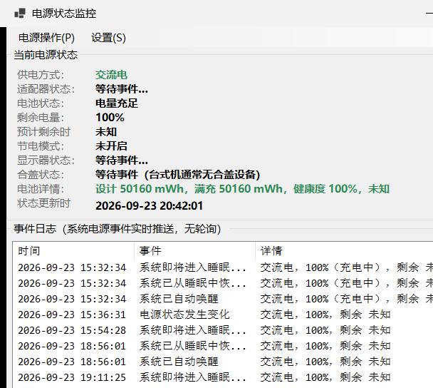

# PowerMonitor — Windows 电源状态监控程序

基于 C# / .NET 10 WinForms 的 Windows 电源状态监控工具。**纯事件驱动**——通过 `WM_POWERBROADCAST` 消息与 `RegisterPowerSettingNotification` 订阅系统电源广播，无定时器轮询，状态变化实时推送。



## 功能特性

### 事件监听

| 事件 | 触发时机 | 实现方式 |
|---|---|---|
| 电源适配器插拔 | 插入/拔出适配器 | `GUID_ACDC_POWER_SOURCE` |
| 电池电量变化 | 电量/充电状态变化 | `PBT_APMPOWERSTATUSCHANGE` + `GetSystemPowerStatus` |
| 显示器开关 | 开启/关闭/变暗 | `GUID_CONSOLE_DISPLAY_STATE` |
| 合盖动作 | 打开/合上盖子 | `GUID_LIDSWITCH_STATE_CHANGE` |
| 睡眠/唤醒 | 即将睡眠、自动/用户唤醒 | `PBT_APMSUSPEND` / `PBT_APMRESUMEAUTOMATIC` / `PBT_APMRESUMESUSPEND` |
| 低电量警告 | 电量严重不足 | `PBT_APMBATTERYLOW` |
| 挂起许可请求 | 系统询问是否允许睡眠 | `PBT_APMQUERYSUSPEND`（可拒绝） |

### 电池检测

通过 WMI 查询系统自带电池的硬件详情：

- 设计容量 / 当前满充容量 / **健康度**（满充÷设计×100%）
- 循环次数、制造商、序列号、化学类型
- **适配器拔出时自动触发检测**，也可点击界面"检测电池"手动查询

### 系统电源操作

通过菜单或托盘右键调用 Win32 API：

- 关机 / 重启（`ExitWindowsEx`，自动启用 `SeShutdownPrivilege`，带二次确认）
- 睡眠 / 休眠（`SetSuspendState`）

### 其他

- **开机自启动**：注册表 `HKCU\...\Run`，菜单勾选即启用，无需管理员权限
- **系统托盘常驻**：关闭窗口最小化到托盘，持续后台监听；关键事件弹出气泡通知
- **诊断日志**：全生命周期落盘至 `%LOCALAPPDATA%\PowerMonitor\app.log`（广播接收、异常、窗体关闭原因）

## 环境要求

- Windows 10 / 11（x64）
- .NET 10 运行时（或使用自包含发布）

## 构建与运行

```powershell
# 调试运行
dotnet run

# 发布为单文件可执行程序（约 516 KB）
dotnet publish -c Release -r win-x64 --self-contained false -p:PublishSingleFile=true -o publish
```

## 项目结构

```
PowerMonitor/
├── Program.cs                      # 入口：全局异常捕获 + 启动监控服务
├── Models/
│   ├── PowerStatusInfo.cs          # 电源快照（GetSystemPowerStatus 映射）
│   ├── PowerEventKind.cs           # 电源广播事件枚举
│   ├── PowerStateChangedEventArgs.cs
│   └── BatteryDetailInfo.cs        # 电池硬件详情模型
├── Services/
│   ├── PowerStateService.cs        # 核心：隐藏消息窗口监听电源广播
│   ├── BatteryQueryService.cs      # WMI 电池详情查询
│   ├── SystemPowerService.cs       # 关机/重启/睡眠/休眠 API
│   ├── AutoStartService.cs         # 开机自启管理
│   └── AppLog.cs                   # 文件日志
└── Views/
    └── MainForm.cs                 # 主界面：状态面板/事件日志/托盘
```

## 技术要点

- **消息窗口监听**：`NativeWindow` 创建隐藏窗口接收 `WM_POWERBROADCAST`，所有订阅者异常均被捕获，不会拖垮消息循环
- **特权提升**：调用 `ExitWindowsEx` 前通过 `AdjustTokenPrivileges` 启用 `SeShutdownPrivilege`，并正确处理 `ERROR_NOT_ALL_ASSIGNED`
- **线程安全**：事件经 `BeginInvoke` 入队更新 UI，避免在系统广播调用栈内重入；WMI 查询在后台线程执行

## License

MIT
