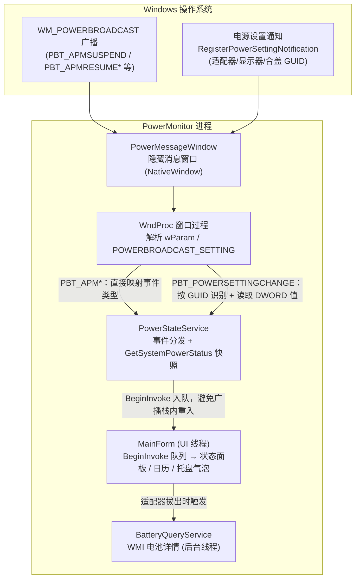
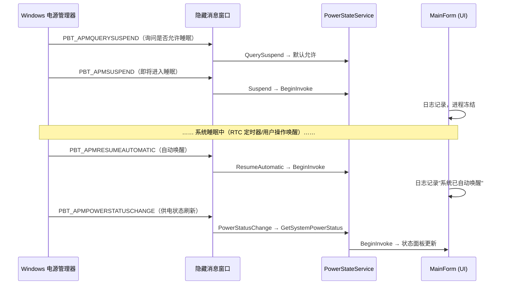

# PowerMonitor — Windows 电源状态监控程序


基于 C# / .NET 10 WinForms 的 Windows 电源状态监控工具。**纯事件驱动**——通过 `WM_POWERBROADCAST` 消息与 `RegisterPowerSettingNotification` 订阅系统电源广播，无定时器轮询，状态变化实时推送。


## 功能特性

### 事件监听

| 事件 | 触发时机 | 实现方式 |
|---|---|---|
| 电源适配器插拔 | 插入/拔出适配器 | `GUID_ACDC_POWER_SOURCE` |
| 电池电量变化 | 电量/充电状态变化 | `PBT_APMPOWERSTATUSCHANGE` + `GetSystemPowerStatus` |
| 显示器开关 | 开启/关闭/变暗 | `GUID_CONSOLE_DISPLAY_STATE` |
| 合盖动作 | 打开/合上盖子 | `GUID_LIDSWITCH_STATE_CHANGE` |
| 睡眠/唤醒 | 即将睡眠、自动/用户唤醒 | `PBT_APMSUSPEND` / `PBT_APMRESUMEAUTOMATIC` / `PBT_APMRESUMESUSPEND` |
| 低电量警告 | 电量严重不足 | `PBT_APMBATTERYLOW` |
| 挂起许可请求 | 系统询问是否允许睡眠 | `PBT_APMQUERYSUSPEND`（可拒绝） |

### 电池检测

通过 WMI 查询系统自带电池的硬件详情：

- 设计容量 / 当前满充容量 / **健康度**（满充÷设计×100%）
- 循环次数、制造商、序列号、化学类型
- **适配器拔出时自动触发检测**，也可点击界面"检测电池"手动查询

### 系统电源操作

通过菜单或托盘右键调用 Win32 API：

- 关机 / 重启（`ExitWindowsEx`，自动启用 `SeShutdownPrivilege`，带二次确认）
- 睡眠 / 休眠（`SetSuspendState`）

### 其他

- **开机自启动**：注册表 `HKCU\...\Run`，菜单勾选即启用，无需管理员权限
- **系统托盘常驻**：关闭窗口最小化到托盘，持续后台监听；关键事件弹出气泡通知
- **诊断日志**：全生命周期落盘至 `%LOCALAPPDATA%\PowerMonitor\app.log`（广播接收、异常、窗体关闭原因）

## 环境要求

- Windows 10 / 11（x64）
- .NET 10 运行时（或使用自包含发布）

## 下载安装

前往 [Releases](https://github.com/yangweigao/PowerMonitor/releases) 下载 `PowerMonitor.exe`（约 516 KB 单文件），放到任意目录直接运行即可，无需安装。

如需完全独立运行（目标机器无 .NET 10 运行时），可自行以自包含方式发布：

```powershell
dotnet publish -c Release -r win-x64 --self-contained true -p:PublishSingleFile=true -o publish
```

## 使用说明

1. **启动监控**：程序启动后自动开始监听，状态面板显示当前供电方式、电池状态、剩余电量等
2. **查看事件**：底部"事件日志"实时记录系统电源事件（系统推送，无轮询）
3. **最小化到托盘**：点击窗口关闭按钮仅隐藏到系统托盘，后台持续监听；双击托盘图标恢复窗口，右键托盘可执行电源操作或退出
4. **检测电池**：点击底部"检测电池"按钮查询电池硬件详情（设计容量、健康度、循环次数）；拔出适配器时也会自动检测
5. **电源操作**：菜单栏"电源操作"或托盘右键，可执行睡眠/休眠/关机/重启（关机、重启有二次确认）
6. **开机自启**：菜单栏"设置 → 开机自启动"勾选后，Windows 登录时自动运行

## 常见问题

**Q：台式机可以用吗？**
可以。合盖事件仅笔记本有；没有电池的台式机，电池相关字段显示"未安装电池"，适配器插拔事件仍正常。

**Q：电池显示容量正常，但拔掉适配器直接关机？**
容量数字来自电池计量芯片的缓存，不代表电芯能实际放电。此现象多为电池保护板锁死或电芯老化失效（硬件问题），可尝试静电复位（长按电源键 30~60 秒）或联系售后检测电池。

**Q：休眠选项报错？**
系统可能未启用休眠，以管理员身份执行 `powercfg /hibernate on` 后重试。

**Q：睡眠唤醒后监控会中断吗？**
不会。程序在唤醒后会收到 `ResumeAutomatic`/`ResumeSuspend` 广播并继续正常监听，已实测验证。

## 构建与运行

```powershell
# 克隆后调试运行
dotnet run

# 发布为单文件可执行程序（约 516 KB）
dotnet publish -c Release -r win-x64 --self-contained false -p:PublishSingleFile=true -o publish
```

## 项目结构

```
PowerMonitor/
├── Program.cs                      # 入口：全局异常捕获 + 启动监控服务
├── Models/
│   ├── PowerStatusInfo.cs          # 电源快照（GetSystemPowerStatus 映射）
│   ├── PowerEventKind.cs           # 电源广播事件枚举
│   ├── PowerStateChangedEventArgs.cs
│   └── BatteryDetailInfo.cs        # 电池硬件详情模型
├── Services/
│   ├── PowerStateService.cs        # 核心：隐藏消息窗口监听电源广播
│   ├── BatteryQueryService.cs      # WMI 电池详情查询
│   ├── SystemPowerService.cs       # 关机/重启/睡眠/休眠 API
│   ├── AutoStartService.cs         # 开机自启管理
│   └── AppLog.cs                   # 文件日志
└── Views/
    └── MainForm.cs                 # 主界面：状态面板/事件日志/托盘
```

## 技术要点

- **消息窗口监听**：`NativeWindow` 创建隐藏窗口接收 `WM_POWERBROADCAST`，所有订阅者异常均被捕获，不会拖垮消息循环
- **特权提升**：调用 `ExitWindowsEx` 前通过 `AdjustTokenPrivileges` 启用 `SeShutdownPrivilege`，并正确处理 `ERROR_NOT_ALL_ASSIGNED`
- **线程安全**：事件经 `BeginInvoke` 入队更新 UI，避免在系统广播调用栈内重入；WMI 查询在后台线程执行

## 架构原理

### 组件结构

隐藏消息窗口是整个监控的核心：Windows 电源管理器只会向窗口句柄投递 `WM_POWERBROADCAST`，程序用 `NativeWindow` 创建一个永不显示的窗口专门接收。



### 事件流时序（一次典型睡眠-唤醒循环）



### 关键设计点

| 设计 | 说明 | 解决的问题 |
|---|---|---|
| BeginInvoke 入队 | 事件处理不直接在系统广播调用栈内执行 | 广播栈内重入 UI 导致死锁/卡顿 |
| 订阅者异常隔离 | 窗口过程内 try/catch 包裹所有事件分发 | 单个事件处理失败拖垮整个进程 |
| 注册失败即抛出 | `RegisterPowerSettingNotification` 返回 0 时抛带错误码异常 | 静默失效导致"永远收不到事件"难排查 |
| 睡眠冻结无感知 | 进程随系统挂起，唤醒后窗口句柄与注册自动恢复 | 无需唤醒后重建监听，已实测验证 |

## 更新日志

### v1.0.0（2026-09-23）

首个正式版本：

- 事件驱动监听：适配器插拔、电池状态、显示器开关、合盖动作、睡眠/唤醒、低电量警告、挂起许可请求
- 电池硬件详情检测（WMI：设计容量/满充容量/健康度/循环次数），适配器拔出自动触发
- 系统电源操作：关机/重启/睡眠/休眠
- 开机自启动（注册表 HKCU Run）
- 系统托盘常驻 + 气泡通知、事件日志界面、文件诊断日志

## Roadmap

- [ ] 电池通讯异常预警：检测"插电却报告放电"、容量/电压为无效哨兵值等矛盾状态并红字告警
- [ ] 更多电源设置 GUID：电源方案切换（`GUID_POWERSCHEME_PERSONALITY`）、电池充电状态、节能模式变化
- [ ] 自包含发布：提供免装 .NET 运行时的 Release 附件
- [ ] 多语言界面（英文）

## License

MIT
